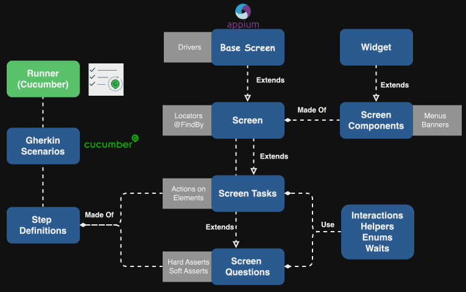

# Mobile Automation Framework

## Introduction

Welcome to the Mobile Automation Framework, a solution designed to test Clipper's mobile applications on both Android and iOS platforms. Leveraging **TestNG**, **Cucumber**, and **Appium**, this framework also supports API testing, providing a comprehensive tool for all your testing needs.

## Table of Contents

1. [Architecture](#architecture)
2. [Getting Started](#getting-started)
3. [Documentation](#documentation)
4. [Build and Test](#build-and-test)
6. [License](#license)


## Architecture
The Mobile Automation Framework is designed with a hybrid architecture that combines the Screenplay and Page Object design patterns. This architecture ensures modularity, reusability, and maintainability of the test code. Below is a high-level overview of the framework's architecture.



## Getting Started

### Prerequisites
Before you begin, ensure you have met the following requirements:

- **Java 17**: Make sure you have Java Development Kit (JDK) 17 installed.
- **IntelliJ IDEA**: Recommended IDE for development.
- **Allure Command Line**: For generating test reports.
- **Checkstyle**: For code style checks.
- **Code Formatter**: Ensure your code adheres to the project's formatting rules.
- **Plugins for IntelliJ IDEA**:
    - **Checkstyle-IDEA**
    - **Cucumber for Java**
    - **Gherkin**
    - **Lombok**
    - **SonarLint**
- ### Setting Up IntelliJ IDEA

1. **Install Plugins**:
    - Go to `File > Settings > Plugins`.
    - Search for and install the following plugins:
        - Checkstyle-IDEA
        - Cucumber for Java
        - Gherkin
        - Lombok
        - SonarLint

2. **Configure Lombok**:
    - Ensure annotation processing is enabled: `File > Settings > Build, Execution, Deployment > Compiler > Annotation Processors` and check "Enable annotation processing".

3. **Configure Checkstyle**:
    - Go to `File > Settings > Tools > Checkstyle`.
    - Import the `QACheckstyle.xml` config included in the repo.
   
4. **Set Up Code Formatter**:
    - Go to `File > Settings > Code Style`.
    - Import the `QACheckstyle.xml` config included in the repo

5. **Install Allure Command Line**:
    - Follow the installation instructions from the [Allure documentation](https://docs.qameta.io/allure/#_installing_a_commandline).

## Documentation
For detailed information on each package, refer to the respective README files:

- [Enums](lac-test/src/main/java/com/automation/lac/qa/fanapp/mobile/enums/README.md)
- [Hooks](lac-test/src/main/java/com/automation/lac/qa/fanapp/mobile/hooks/README.md)
- [Questions](lac-test/src/main/java/com/automation/lac/qa/fanapp/mobile/questions/README.md)
- [Screens](lac-test/src/main/java/com/automation/lac/qa/fanapp/mobile/screens/README.md)
- [StepsDefinitions](lac-test/src/main/java/com/automation/lac/qa/fanapp/mobile/stepsdefinitions/README.md)
- [Tasks](lac-test/src/main/java/com/automation/lac/qa/fanapp/mobile/tasks/README.md)
- [Utils](lac-test/src/main/java/com/automation/lac/qa/fanapp/mobile/utils/README.md)

## Build and Test

To build and test the project, you can use the following Maven command. This command allows you to parameterize the platform, path, and Cucumber tags among other options:

```bash
mvn clean test -DsuiteXmlFiles=local.xml \
    -Dframework.platform.name=Android \
    -Dframework.platform.version=14 \
    -Dframework.device.name=emulator-5554 \
    -Dframework.mobile.app="/absolute-path/app.apk" \
    -Dframework.videoRecording=true \
    -Dcucumber.filter.tags="@missions" \
    -DthreadCount=1
``` 

## License

All rights reserved. This project and its content are the property of Clippers. Unauthorized copying, distribution, modification, or any other use of this project, in whole or in part, is strictly prohibited without prior written permission from Clippers.
