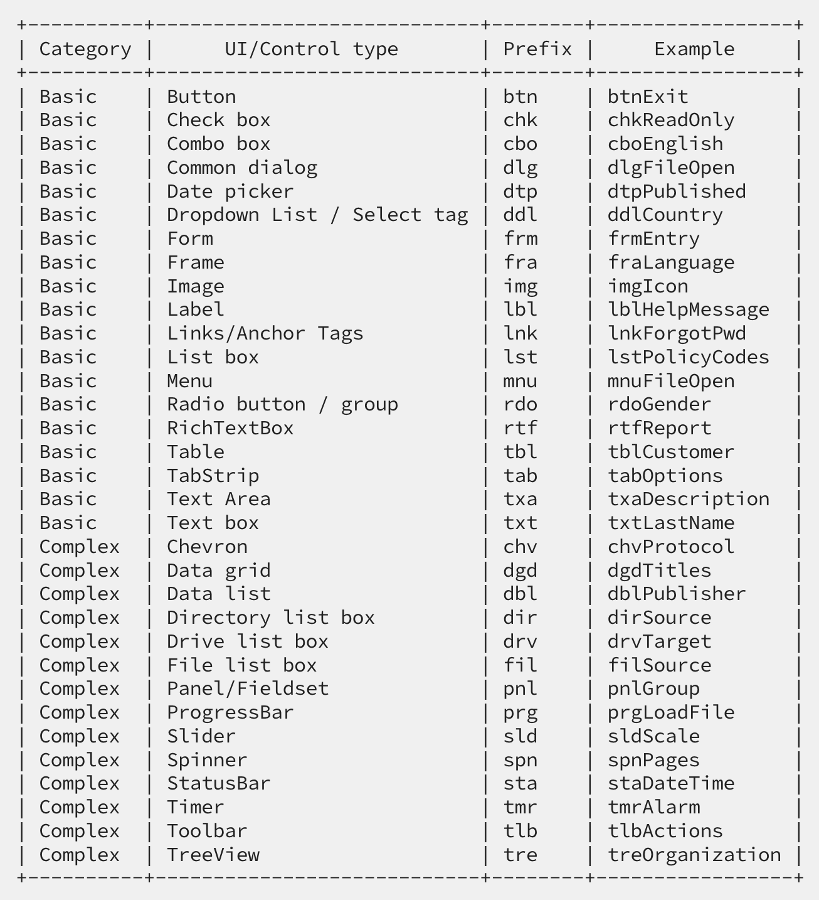

# Screen Locators Directory

Welcome to the Screen Locators directory for our mobile automation project. This directory contains classes that define the locators for UI elements on different screens within the mobile application. Each class represents a screen and contains locators for the elements on that screen.

## Directory Structure

The classes within this directory are named after the screens they represent, with the suffix `Screen` to indicate their role within the project, such as `HomeScreen`, `LoginScreen`, etc.

## Class and Locator Guidelines

- Each screen class should extend the `MobileBaseScreen` class or a similar base class that provides common functionality.
- Define locators using appropriate annotations provided by the Appium framework (e.g., `@AndroidFindBy`, `@iOSXCUITFindBy`).
- Group locators logically within the class to reflect the grouping of elements on the screen.
- Use descriptive variable names for locators to clearly indicate the element they refer to.

## Example Screen

Here is an example of a screen class, `WelcomeHomeScreen`, which extends `MobileBaseScreen` and defines various UI elements present on the Welcome Home screen.

### WelcomeHomeScreen.java

```java
/**
 * Screen class representing the Welcome Home screen.
 */
@Getter
public class WelcomeHomeScreen extends MobileBaseScreen {

    @AndroidFindBy(accessibility = "Create an account")
    @iOSXCUITFindBy(accessibility = "primary_rectangle_button")
    private WebElement btnCreateAnAccount;

    @iOSXCUITFindBy(iOSClassChain = "//XCUIElementTypeOther[starts-with(@label, 'Skip, button')]")
    @AndroidFindBy(xpath = "//android.widget.TextView[@text='Skip']/..")
    private WebElement btnSkip;
}
```
## Widgets
Widgets are designed to encapsulate the logic and interactions of specific UI elements, making your automation code more modular, reusable, and maintainable. By using widgets, you can create a more organized and clear structure for handling complex UI components.

### Defining a Widget

Let's define a widget that encapsulates the elements of a card.

```java
public class CardWidget extends Widget {

  public CardWidget(WebElement element) {
    super(element);
  }

  @AndroidFindBy(id = "card_title")
  private WebElement cardTitle;

  @AndroidFindBy(id = "card_description")
  private WebElement cardDescription;
}
```
### Using the Widget in a Screen
To use the CardWidget in a screen, you need to locate the container element that holds the widget. Let's create a screen that directly uses the CardWidget.
```java
public class HomeScreen {

  @AndroidFindBy(id = "card")
  private CardWidget cardElement;
}
```
## UI/Control Naming Conventions

To standardize the naming of elements in screens and widgets, please follow the conventions listed below.




## Components (Deprecated)🚨
A reusable component encapsulates elements and actions related to a specific part of the application. This allows us to reuse the code across different screens without duplicating it.

```java
@Getter
public class ReusableComponent extends MobileBaseComponent {

  @AndroidFindBy(accessibility = "Component Element 1")
  @iOSXCUITFindBy(iOSNsPredicate = "component_element_1")
  private WebElement componentElement1;

  @AndroidFindBy(accessibility = "Component Element 2")
  @iOSXCUITFindBy(accessibility = "component_element_2")
  private WebElement componentElement2;
}
```
### Use of components
The HypotheticalScreen class represents a hypothetical screen of the application. It includes the ReusableComponent to leverage its functionality, demonstrating the use of components within a screen.

```java
@Getter
public class HypotheticalScreen extends MobileBaseScreen {
  private final ReusableComponent reusableComponent;

  public HypotheticalScreen() {
    this.reusableComponent = new ReusableComponent();
  }

  @AndroidFindBy(accessibility = "Screen Element 1")
  @iOSXCUITFindBy(accessibility = "screen_element_1")
  private WebElement screenElement1;
}
```
## Observations 🚨

- Do not forget that the components or widgets must be used within the screens. These screens, in turn, will be extended to the task class associated to the screen, where the tasks that interact with both the components and the screen itself will be created.
- If there are common tasks within a component that is used by multiple screens, the task creation can be handled within the component. It is important to note that this is only allowed in components and with repetitive tasks.